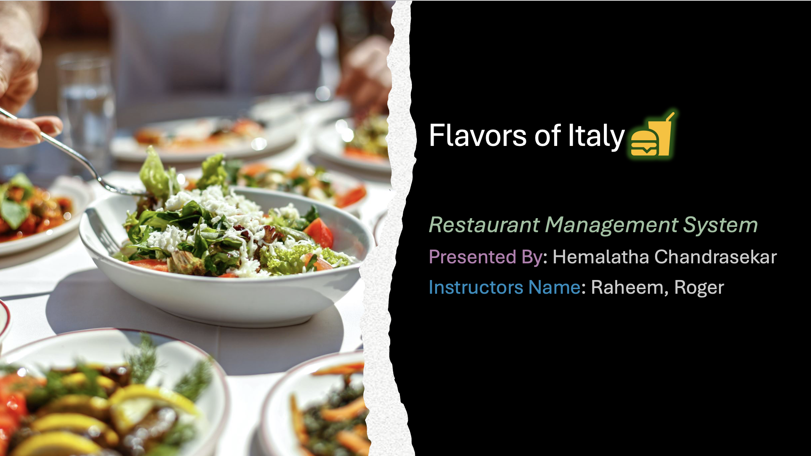
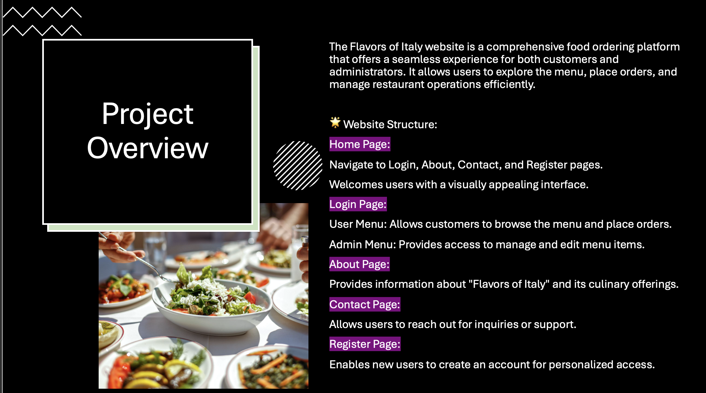
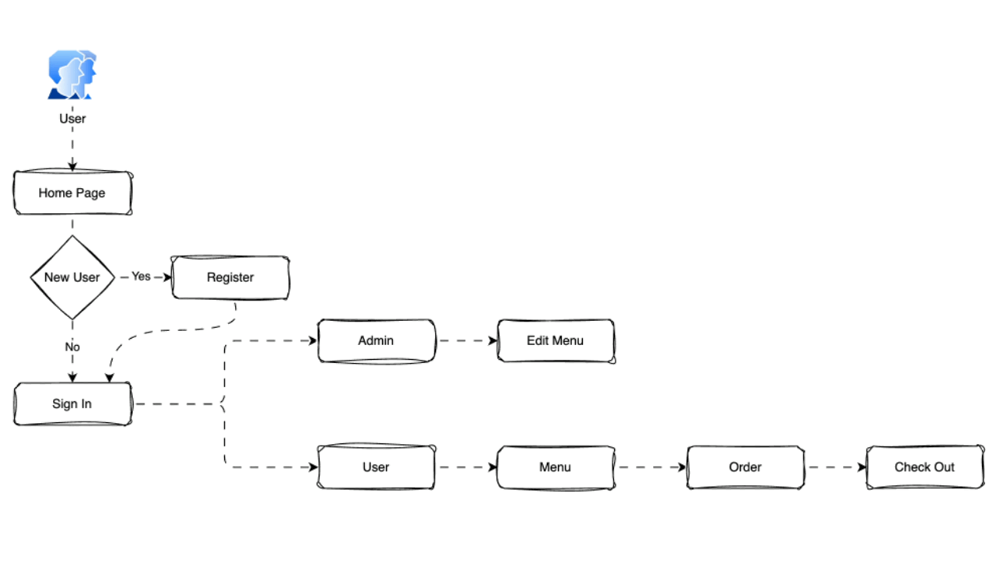
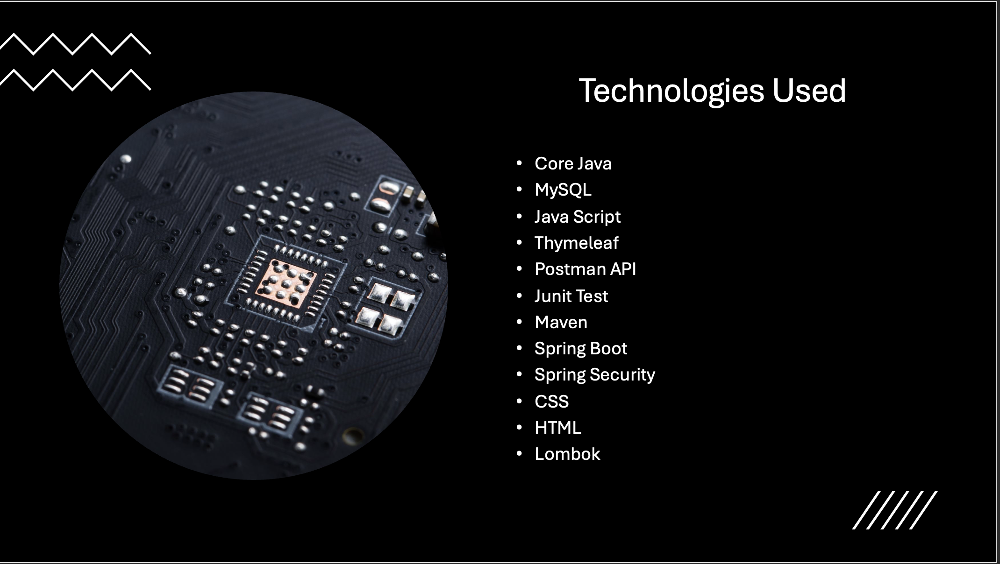
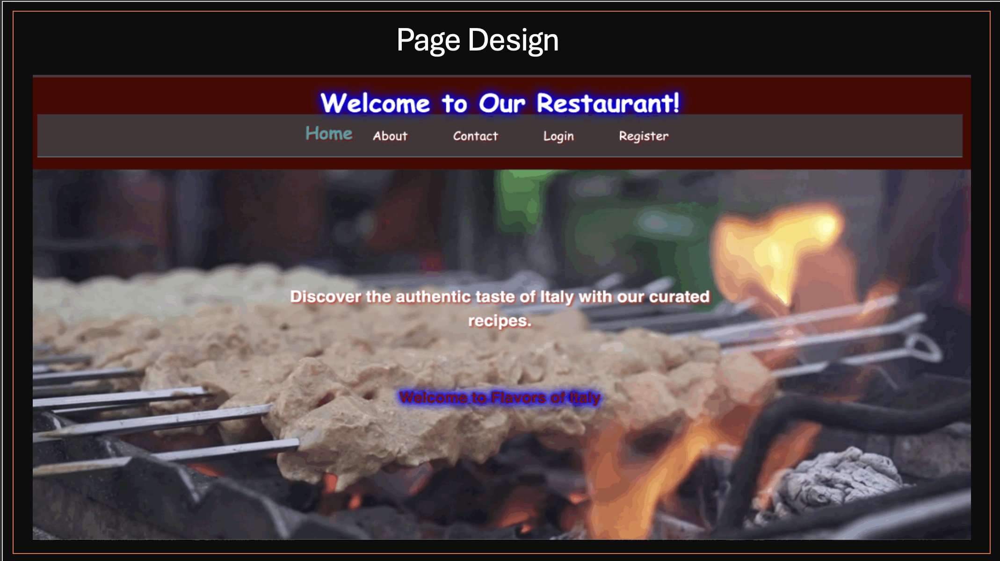

# Restaurant Management System

## Project Overview

This Restaurant Management System is a Spring Boot application designed to streamline restaurant operations. It provides a user-friendly interface for administrators to manage the menu, while allowing customers to view the menu, place orders, and complete the checkout process. This system aims to improve efficiency, enhance customer experience, and simplify restaurant administration.

